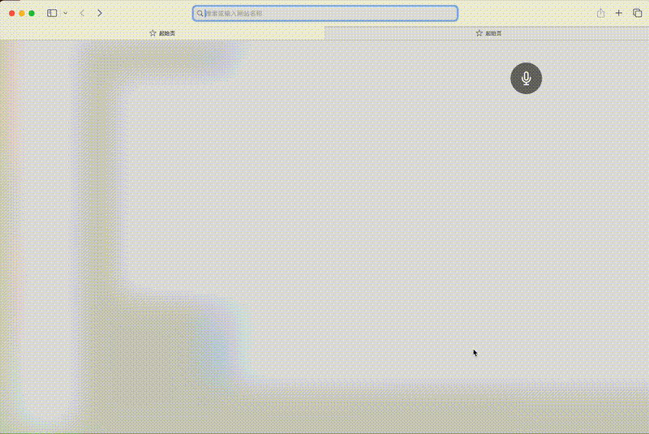

# VoxMind

A macOS menu bar voice input app that runs fully on-device offline, with speech recognition plus optional LLM correction—turn speech into text and paste it into any app.

## Demo



## Project architecture

```
voxmind/
├── src/
│   ├── main/                     # Electron main process
│   │   ├── index.ts              # Entry: app lifecycle, global shortcut (Cmd+Shift+Space)
│   │   ├── window.ts             # Floating ball window (80x80, transparent, frameless)
│   │   ├── tray.ts               # System tray icon + context menu
│   │   ├── ipc-handlers.ts       # IPC hub (asr:start/stop, audio:chunk)
│   │   ├── settings.ts           # Settings read/write (~/.../voxmind/settings.json)
│   │   ├── permissions.ts        # Microphone & Accessibility checks
│   │   ├── injector.ts           # Text injection: clipboard + AppleScript paste/Enter
│   │   ├── model-manager.ts      # Model paths & existence checks
│   │   ├── downloader.ts         # Auto-download: progress, redirects, tar.bz2 extract
│   │   ├── download-window.ts    # Download progress window (progress bar + percent)
│   │   ├── history.ts            # Transcript history (per-day JSON, 500 MB cap)
│   │   ├── asr/
│   │   │   ├── engine.ts         # ASR: Silero VAD + SenseVoice offline
│   │   │   └── audio-buffer.ts   # PCM ring buffer (60s, 16 kHz, 512-aligned)
│   │   └── llm/
│   │       └── engine.ts         # LLM correction: node-llama-cpp + Qwen 2.5 1.5B
│   │
│   ├── preload/
│   │   └── index.ts              # Bridge: contextBridge exposes electronAPI
│   │
│   └── renderer/                 # React renderer
│       ├── index.html
│       ├── index.tsx              # React entry
│       ├── App.tsx                # Root component
│       ├── components/
│       │   └── FloatingBall.tsx   # Floating ball: click to record, drag, status animation
│       ├── hooks/
│       │   └── useAudioCapture.ts # Mic capture (WebAudio 16 kHz → PCM)
│       └── styles/
│           └── ball.css           # Floating ball styles & animation
│
├── resources/                     # App + tray icons (tray.png, @2x)
└── electron-builder.yml           # Packaging (universal: Intel + Apple Silicon)
```

## Data flow

```
🎙 Mic → WebAudio (16 kHz) → IPC audio:chunk → ASR Engine
                                                    ├── Silero VAD (voice activity)
                                                    └── SenseVoice (offline ASR)
                                                          ↓
                                                    Raw text
                                                          ↓
                                              [LLM correction optional]
                                              Qwen 2.5 fixes homophones / punctuation
                                                          ↓
                                                    Final text
                                                          ↓
                                        ┌─────────────────┼─────────────────┐
                                        ↓                 ↓                 ↓
                                  Clipboard paste     Save history        Renderer
                                  + simulated Enter   JSON files          display
                                  (Auto Send)         (per-day folders)
```

## Model files

Models are not bundled; they download on first use into the app data directory.

| Model             | Path                                                                                  | Size   | When downloaded                          |
| ----------------- | ------------------------------------------------------------------------------------- | ------ | ---------------------------------------- |
| Silero VAD        | `data/models/silero_vad.onnx`                                                         | ~632KB | Auto on first launch                     |
| SenseVoice ASR    | `data/models/sherpa-onnx-sense-voice-zh-en-ja-ko-yue-int8-2024-07-17/model.int8.onnx` | ~228MB | Auto on first launch                     |
| SenseVoice tokens | `data/models/sherpa-onnx-sense-voice-zh-en-ja-ko-yue-int8-2024-07-17/tokens.txt`      | ~308KB | Auto on first launch                     |
| Qwen 2.5 1.5B     | `data/models/llm/qwen2.5-1.5b-instruct-q4_k_m.gguf`                                   | ~1GB   | On demand when LLM Correction is enabled |

Sources:

- Silero VAD / SenseVoice: GitHub Releases (`k2-fsa/sherpa-onnx`)
- Qwen LLM: Hugging Face (`Qwen/Qwen2.5-1.5B-Instruct-GGUF`)

A separate progress window shows download status; the floating ball is disabled until the download finishes.

## Design highlights

- **Fully local**: ASR and LLM run offline (network only needed for the initial model download)
- **Universal build**: Apple Silicon and Intel Macs
- **Automatic model download**: ASR on first launch; LLM when you enable correction—no manual steps
- **Menu bar app**: `LSUIElement: true` + `dock.hide()`—no Dock icon
- **Two triggers**: Click the floating ball or global shortcut `Cmd+Shift+Space`
- **Text injection**: Save clipboard → write text → AppleScript to front app → Cmd+V → restore clipboard

## Tray menu

| Option           | Description                                              |
| ---------------- | -------------------------------------------------------- |
| LLM Correction   | Toggle LLM text correction (downloads model on first use) |
| Open at Login    | Launch at login                                          |
| Auto Send        | Press Enter after paste                                  |
| Open Data Folder | Open app data (models + history)                         |
| Quit             | Quit the app                                             |

## App data directory

Path: `~/Library/Application Support/voxmind/data/`

```
data/
├── models/       ← ASR + LLM model files
└── history/      ← Transcript history
    └── YYYY-MM-DD/
        └── transcripts.json
```

- History JSON shape: `{ "HH:mm:ss": { "raw": "ASR text", "corrected": "corrected text or null" } }`
- Both raw ASR and corrected text are stored
- When total size exceeds 500 MB, the oldest date folders are removed

## Development

```bash
# Install dependencies
npm install

# Dev mode
npm run dev

# Build DMG
npm run package
```

## System requirements

| Item        | Requirement                                              |
| ----------- | -------------------------------------------------------- |
| OS          | macOS 11.0 (Big Sur) or later                            |
| CPU         | Apple Silicon (M1/M2/M3/M4) and Intel                    |
| Disk        | ~1.5 GB (app + models)                                   |
| Network     | Only for first-time model download; fully offline after  |

## Installation

1. Download `voxmind-1.0.0-universal.dmg`
2. Open the DMG and drag VoxMind into Applications
3. On first open, right-click VoxMind.app → **Open** → confirm (Gatekeeper may block unsigned apps)

> Or run `xattr -cr /Applications/VoxMind.app` in Terminal, then open normally

## First launch

On launch, the app will:

1. **Request permissions** — microphone and Accessibility (required)
2. **Download speech models** — ASR (~229 MB) with a progress window
3. **Ready** — floating ball appears bottom-right; Shiba tray icon in the menu bar

### Permissions

| Permission   | Purpose                                      | Location                                              |
| ------------ | -------------------------------------------- | ----------------------------------------------------- |
| Microphone   | Record audio for recognition                 | System Settings → Privacy & Security → Microphone     |
| Accessibility | Simulate paste, detect focused app        | System Settings → Privacy & Security → Accessibility |

## Basic usage

### Voice input

1. Focus any text field (WeChat, Feishu, VS Code, browser, etc.)
2. **Click the floating ball** or press **⌘ + Shift + Space** to start recording
3. **Click again** or press **⌘ + Shift + Space** to stop
4. Recognized text is pasted into the app that was focused when recording started

> Processing is fully offline; audio is not uploaded to any server

### Floating ball states

| State       | Appearance                             | Meaning                               |
| ----------- | -------------------------------------- | ------------------------------------- |
| Idle        | Gray semi-transparent ball + mic icon  | Waiting for click or shortcut         |
| Recording   | Red ball + pulse                       | Recording; live preview text          |
| Processing  | Gray ball + spinner                    | Transcribing / correcting             |
| Downloading | Gray semi-transparent (not clickable)  | Downloading models                    |

### Moving the ball

Drag the ball anywhere on screen; position is saved and restored on next launch.

## Menu bar options

Click the Shiba icon in the menu bar:

### LLM Correction

- Off by default
- First enable downloads Qwen 2.5 1.5B (~1 GB)
- When on, ASR output is corrected locally for homophones, punctuation, mixed Chinese/English, etc.
- Example: `我要用 python 写一个 jason 解析器` → `我要用 Python 写一个 JSON 解析器`

### Open at Login

- Runs VoxMind when macOS starts

### Auto Send

- After paste, simulates Enter to send
- Handy in chat apps (WeChat, Feishu, Slack, etc.)
- Waits 1 second after paste before Enter so text is committed

### Open Data Folder

- Opens the data folder in Finder (models and history)

### Quit

- Fully quits VoxMind

## Shortcuts

| Shortcut          | Action                                          |
| ----------------- | ----------------------------------------------- |
| ⌘ + Shift + Space | Start/stop recording (global, works in any app) |

## Supported languages

Recognition auto-detects language; no manual switching:

- Chinese (Mandarin)
- English
- Japanese
- Korean
- Cantonese

Mixed Chinese–English speech is supported.

## Data storage

Everything stays on disk locally:

```
~/Library/Application Support/voxmind/
├── settings.json              # User settings
└── data/
    ├── models/                # AI model files
    │   ├── silero_vad.onnx                         # VAD model (~632 KB)
    │   ├── sherpa-onnx-sense-voice-.../             # ASR model (~228 MB)
    │   └── llm/qwen2.5-1.5b-instruct-q4_k_m.gguf  # LLM model (~1 GB, optional)
    └── history/               # Transcript history
        └── YYYY-MM-DD/
            └── transcripts.json
```

- History is capped at 500 MB; oldest entries are removed when exceeded
- **App updates do not delete this data** — safe to replace the app in Applications

## Updating

1. Download the new DMG
2. Quit VoxMind (menu bar → Quit)
3. Drag the new build into Applications over the old one
4. Reopen; models and history remain

## FAQ

### Floating ball missing?

VoxMind has no Dock icon—check the menu bar for the Shiba. If absent, the app may not be running; open it from Launchpad or Applications.

### Ball does not respond?

Ensure Accessibility is granted: System Settings → Privacy & Security → Accessibility → enable VoxMind. Restart the app after changing permissions.

### No text after recording?

Check Microphone permission: System Settings → Privacy & Security → Microphone → enable VoxMind.

### Text pasted into the wrong app?

VoxMind remembers the focused app when recording starts. Focus the target field before clicking the ball. **⌘ + Shift + Space** gives finer control.

### Internet required?

Only for the first-time model download. After that, everything runs offline; no data is sent to remote servers, and all data stays local.
